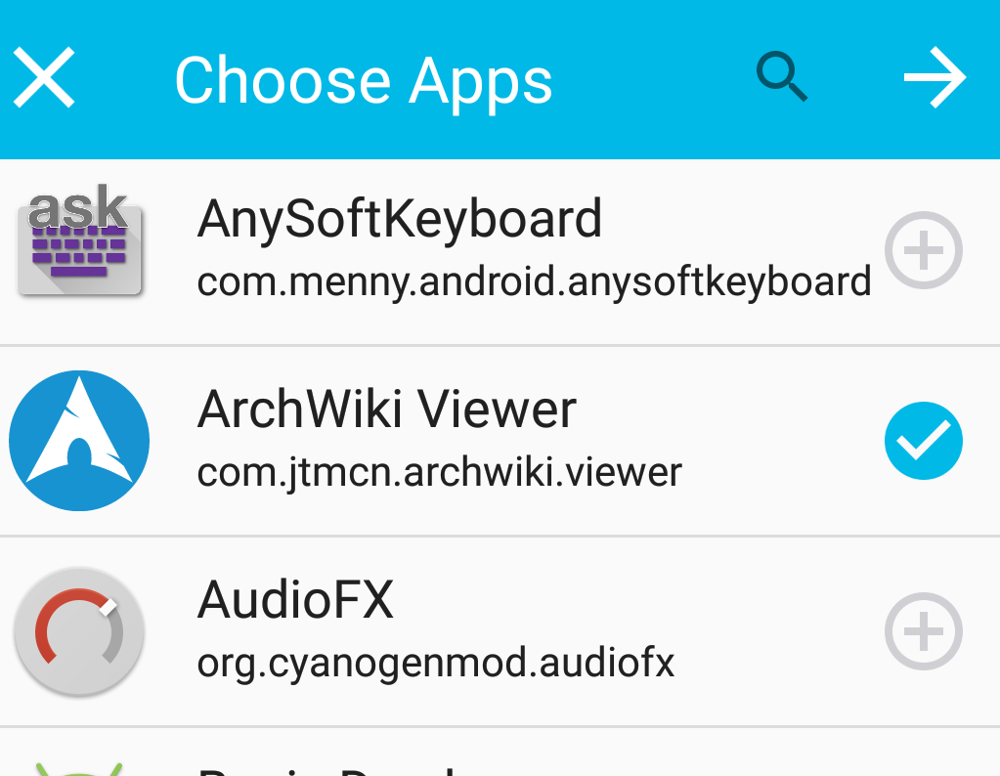

# Serve And Share Apps From Your Phone With Fdroid

## Find The Menu Item for *Swap apps*
### Step 3 you are born on third base
#### Open fdroid, and navigate to the menu by touching three dots in upper right hand corner of the screen. Select *Swap apps*.

### Step 4
#### On the next screen toggle on *Visible via Wi-Fi*

### Step 5
#### At the bottom of the screen select *SCAN QR CODE*

### Step 6
#### At the next screen *Choose Apps* you want to xerve I mean serve and then touch the -> right arrow to proceed

### Step 7
#### Touch the -> right arrow again, do it.

### Ocho
#### Touch the -> right arrow until you are coming here

Notice you can use either a qr code or a local url, so grab one of your other phones.  
[Privacy Friendly Qr Scanner](https://github.com/SecUSo/privacy-friendly-qr-scanner) appears to be a good Qr scanner,
but of course you can key in the url by hand too.
### Step Nine
#### On your other phone open fdroid, navigate to menu by selecting the 3 dots in the upper right hand corner and choose *Repositories*

### Step Ten
#### Toggle all the current repos off and then if you want to key in the new local repo url by hand touch the + plus in the upper right hand corner

### Step Eleven A
#### After touching the + plus button in [Step Ten](#step-ten) on phone two, you can fill in the url address that corresponds to the photo in [Ocho](#ocho)

### Step Twelve A
If you prefer not to key in the url by hand, on phone two touch the
home button and then open your qr-scanning application and scan the
qr code on phone one, as seen in photo [Ocho](#ocho). The qr-scanning
app will direct you to open fdroid, and your result will be the same as
the photo in [Step Eleven A](#step-eleven-a)
### Step Thirteen
#### On phone two you can now download and install apps and updates from phone one, and the download speed will be much faster than from the internet.

